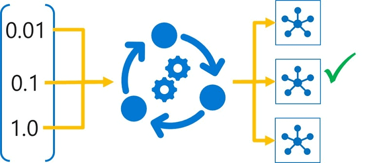

# Hyperparameter Tuning
#### Hyperparameter Tuning with GridSearchCV using classifier algorithms
https://share.streamlit.io/randell-janus/hyperparameter-tuning/main/app.py

  
  

  

## Dataset Source  
The datasets used are the Iris Plants and Wine Recognition from scikit-learn's toy datasets.

## Models Used
* Random Forest Classifier
* Support Vector Machine
* Logistic Regression
  
## Web App Features  
**Made with Streamlit**
* About Information
  * Located inside expanders if users wish to read about what the web app is all about.
* Dataset Selection  
  * Selctbox that allows users to switch between datasets.
* Model Selection  
  * Selectbox that allows useres to select between three different models.
* User Input Parameters  
  * Random Forest - tune the n_estimators and max_depth using slidebar widgets.
  * SVM - Specify the kernel types to be included in the tuning, and tune the C parameters with slider widgets.
  * Logistic Regression - specify the norm used in the penalization and customize the C parameters with slider widgets.
* Tuning Results
  * A dataframe of the value scores of the tuning result such as split test scores and score times.
  * More choices in the multiselect box.
  * A separate dataframe for the best parameters with their respective scores.
    
